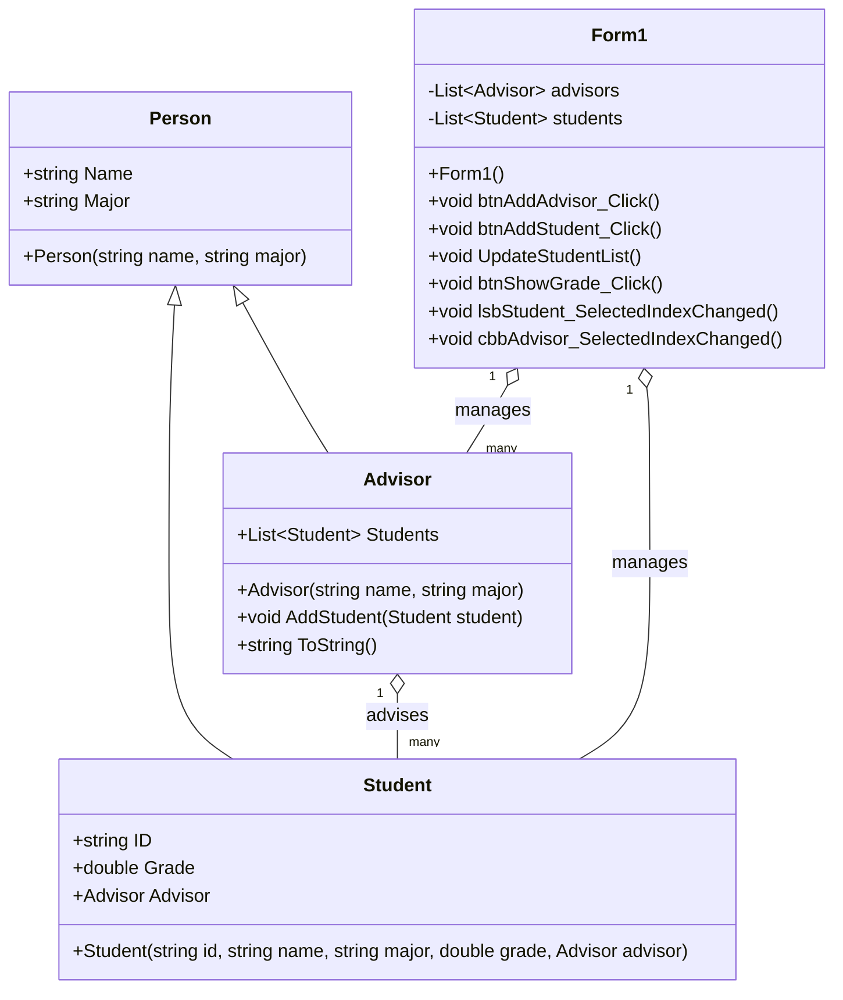

# ระบบบันทึกข้อมูลนักศึกษา
ชื่อ นายอธิวัฒน์ ตั้งฤาษีเจริญ
รหัสนักศึกษา 673450041-1
## รายละเอียดโปรแกรม
โปรแกรมนี้เป็นระบบสำหรับอาจารย์ที่สามารถบันทึกข้อมูลนักศึกษา โดยมีรายละเอียดดังนี้
## นักศึกษา
เก็บข้อมูลรหัสนักศึกษา, ชื่อ-นามสกุล, สาขาที่เรียน, เกรดเฉลี่ย และอาจารย์ที่ปรึกษา
## อาจารย์ที่ปรึกษา
มีชื่อ-นามสกุล, สาขาที่สอน และสามารถดูรายชื่อนักศึกษาที่อยู่ในความดูแลได้
## ฟีเจอร์หลักของโปรแกรม:
-เพิ่มนักศึกษาใหม่ พร้อมกำหนดอาจารย์ที่ปรึกษา

-แสดงรายชื่อนักศึกษาทั้งหมดที่อยู่ในระบบ

-ค้นหานักศึกษาที่มีเกรดสูงสุดและแสดงผล

-แสดงรายชื่อนักศึกษาทั้งหมดที่อยู่ในที่ปรึกษาของอาจารย์แต่ละคน

-อาจารย์สามารถแสดงรายชื่อนักศึกษาของตนได้

## Class Diagram

