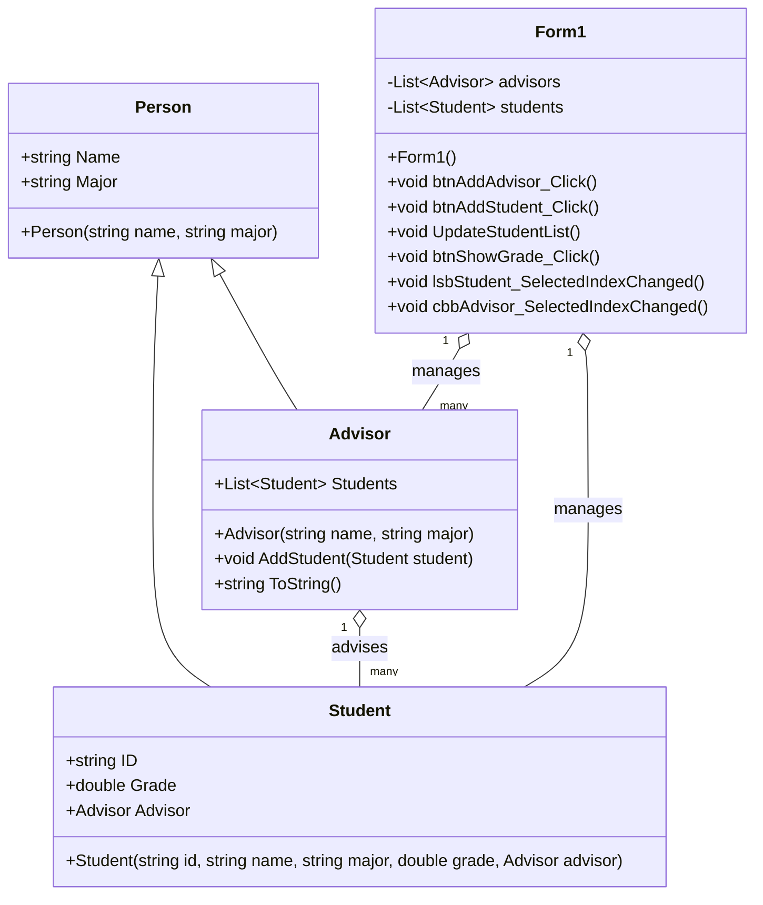

# ระบบบันทึกข้อมูลนักศึกษา
ชื่อ นายอธิวัฒน์ ตั้งฤาษีเจริญ

รหัสนักศึกษา 673450041-1
## รายละเอียดโปรแกรม
โปรแกรมนี้เป็นระบบสำหรับอาจารย์ที่สามารถบันทึกข้อมูลนักศึกษา โดยมีรายละเอียดดังนี้
## นักศึกษา
เก็บข้อมูลรหัสนักศึกษา, ชื่อ-นามสกุล, สาขาที่เรียน, เกรดเฉลี่ย และอาจารย์ที่ปรึกษา
## อาจารย์ที่ปรึกษา
มีชื่อ-นามสกุล, สาขาที่สอน และสามารถดูรายชื่อนักศึกษาที่อยู่ในความดูแลได้
## ฟีเจอร์หลักของโปรแกรม:
-เพิ่มนักศึกษาใหม่ พร้อมกำหนดอาจารย์ที่ปรึกษา

-แสดงรายชื่อนักศึกษาทั้งหมดที่อยู่ในระบบ

-ค้นหานักศึกษาที่มีเกรดสูงสุดและแสดงผล

-แสดงรายชื่อนักศึกษาทั้งหมดที่อยู่ในที่ปรึกษาของอาจารย์แต่ละคน

-อาจารย์สามารถแสดงรายชื่อนักศึกษาของตนได้

## Class Diagram

# หลักการเขียนโปรแกรมเชิงวัตถุที่ใช้ในโปรแกรม
## 1.Encapsulation
-ใช้ Properties ({ get; set; }) ในคลาส Student และ Advisor เพื่อป้องกันการเข้าถึงข้อมูลโดยตรง -ค่าต่างๆ เช่น ชื่อ, สาขา, เกรด, รายชื่อนักศึกษาในที่ปรึกษา ถูกควบคุมผ่านเมธอดที่กำหนด
## 2.Abstraction
-คลาส Person ถูกออกแบบให้เป็นแม่แบบ (Super Class) ที่ใช้เก็บข้อมูลพื้นฐานของทั้ง Student และ Advisor -แยกการทำงานของแต่ละคลาสออกจากกัน ทำให้โค้ดอ่านง่าย และสามารถพัฒนาเพิ่มเติมได้สะดวก
## 3.Inheritance
-คลาส Student และ Advisor สืบทอดจาก คลาส Person ทำให้สามารถใช้คุณสมบัติของ Person ได้โดยไม่ต้องเขียนโค้ดซ้ำ
## 4.Polymorphism
-เมธอด AddStudent(Student student) ใน Advisor ถูกใช้งานเพื่อเพิ่มนักศึกษาเข้ามาในรายชื่อของอาจารย์ที่ปรึกษา -สามารถ ปรับแต่งหรือขยายเมธอดเดิม ในอนาคตเพื่อรองรับการทำงานเพิ่มเติม
# UI App

## How to Use App
1.เปิดโปรแกรม

2.กรอกข้อมูลอาจารย์ที่ปรึกษา จากนั้นกดปุ่ม "Add Advisor"

3.เลือก "Choose Advisor" เพื่อเลือกอาจารย์ที่ปรึกษา

4.กรอกข้อมูลนักศึกษา จากนั้นกดปุ่ม "Add Studnet"

5.คลิกที่ "Show Grade" เพื่อดูนักศึกษาที่มีคะแนนสูงสุดในระบบ

6.เลือกรายชื่อนักศึกษาใน ListBox เพื่อดูรายละเอียดของแต่ละคน

